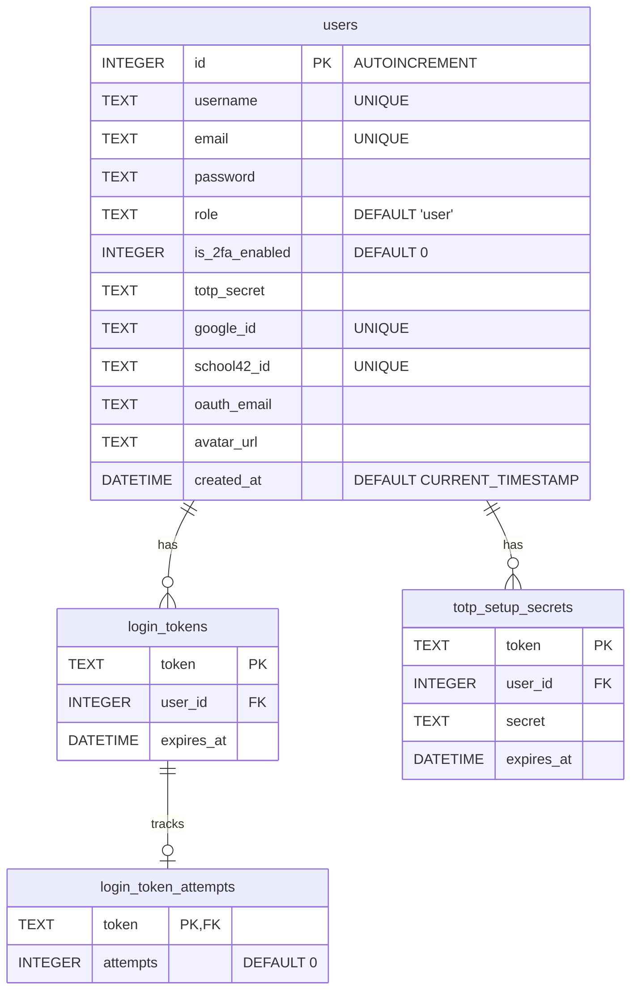
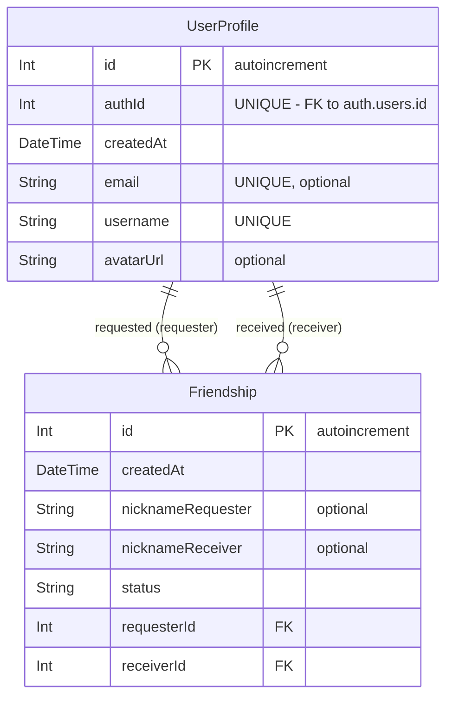
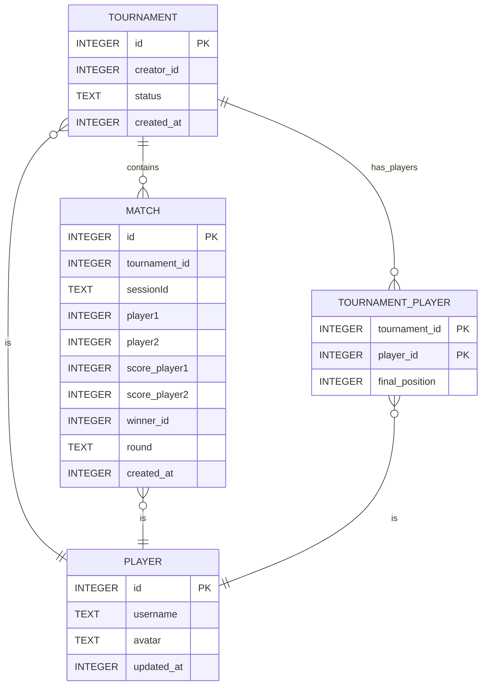

This project has been created as part of the 42 curriculum by lisambet, fpetit, rcaillie, jhervoch, npolack.

## Description

> A full-stack multiplayer Pong web application. Built as a microservices SPA with real-time gameplay, tournament system, OAuth2 auth, 2FA, an AI opponent, and blockchain score storage. It covers a wide range of concepts including real-time communication, modern authentication flows, containerized deployment, and blockchain integration.


```
srcs/
├── auth/           # Authentication service — OAuth2 (42 API), JWT, 2FA
├── users/          # User management service — profiles, stats, friends
├── game/           # Game logic & WebSocket server — real-time Pong engine
├── pong-ai/        # AI opponent service
├── gateway/        # API gateway — routes requests between services
├── blockchain/     # Smart contract — stores match scores on-chain
├── redis/          # Session cache & pub/sub
├── nginx/          # Reverse proxy & HTTPS termination
├── shared/         # Shared types/utilities across services
└── tests/          # Integration & end-to-end test suite
```

## Instructions

### Quick Start

```bash
# 1. Clone the repository

git clone https://github.com/codastream/transcendence.git
cd transcendence

# 2. Set up environment variables

make envs

# → Fill in your 42 OAuth2 credentials in srcs/.env.auth and srcs/.env.nginx

# 3. Build and launch all services

make

# 4. Stop all services

make down

# 5. Build AI opponent service separately (optional)

make ai

# 6. Run tests

make test
```

The app will be available at: **https://localhost:4430**

### Setup Details

The `make` command orchestrates the full setup: volume creation, certificate generation, dependency installation, Docker build, and service startup. Below is what happens at each step.

#### 1. Environment Variables (`make envs`)

Copies all `.env.*.example` files in `srcs/` to their corresponding `.env.*` files and auto-generates a shared `JWT_SECRET` across all of them.

| File                   | Purpose                                                     | Action required                                                   |
| ---------------------- | ----------------------------------------------------------- | ----------------------------------------------------------------- |
| `srcs/.env`            | Global config (service names, ports, volume name)           | Usually no change needed                                          |
| `srcs/.env.auth`       | Auth service (DB path, admin credentials, Redis)            | Change `ADMIN_PASSWORD` in production                             |
| `srcs/.env.oauth`      | OAuth2 secrets (Google & 42 School)                         | **Fill in your client IDs and secrets**                           |
| `srcs/.env.nginx`      | Frontend OAuth public client IDs (Vite build vars)          | **Fill in `VITE_GOOGLE_CLIENT_ID` and `VITE_SCHOOL42_CLIENT_ID`** |
| `srcs/.env.gateway`    | API gateway (rate limits, proxy timeout)                    | Usually no change needed                                          |
| `srcs/.env.um`         | User service (DB path)                                      | Usually no change needed                                          |
| `srcs/.env.game`       | Game service (DB path)                                      | Usually no change needed                                          |
| `srcs/.env.blockchain` | Blockchain service (RPC URL, contract address, private key) | **Fill in Avalanche credentials if using blockchain**             |

> **OAuth2 callback URIs** to register with providers:
>
> - Google: `https://localhost:4430/auth/oauth/google/callback`
> - 42 School: `https://localhost:4430/auth/oauth/school42/callback`

#### 2. Data Volumes (`make volumes`)

Creates the local directories that are bind-mounted into containers:

```
data/
├── database/   # SQLite databases (auth.db, um.db, game.db, blockchain.db)
└── uploads/    # User-uploaded files (avatars)
```

The path defaults to `./data` and can be overridden via `VOLUME_NAME` in `srcs/.env`. These directories are mapped as Docker named volumes in `docker-compose.yml`:

- **`data`** → `data/database/` — mounted at `/data` (auth, game, blockchain) and `/app/data` (users)
- **`uploads`** → `data/uploads/` — mounted at `/app/uploads` (user-service) and `/usr/share/nginx/html/uploads` (nginx, to serve avatars statically)

> ⚠ `make fclean` deletes these directories entirely. `make volumes` recreates them.

#### 3. mTLS Certificates (`make certs`)

Generates a full internal PKI under `make/scripts/certs/certs/`:

```
make/scripts/certs/certs/
├── ca/                     # Internal Certificate Authority
│   ├── ca.key              # CA private key (RSA 4096)
│   └── ca.crt              # CA certificate (valid 10 years)
├── services/               # Per-service client/server certs (RSA 2048, valid 825 days)
│   ├── user-service/
│   ├── auth-service/
│   ├── blockchain-service/
│   ├── game-service/
│   └── api-gateway/
└── nginx/                  # Nginx reverse proxy cert (also serves HTTPS to browser)
    ├── nginx.key
    └── nginx.crt
```

Each service gets a certificate with a SAN matching its Docker service name, enabling **mutual TLS** between all backend services. The CA cert is mounted as read-only into every container at `/etc/ca/`.

Certificates are generated once and reused. To regenerate: `rm -rf make/scripts/certs/certs && make certs`.

#### 4. Build & Run

```bash
make          # Full pipeline: volumes → certs → npm install → docker build → up -d
make dev      # Development mode (with hot-reload via dev-docker-compose.yml)
make re       # Full clean rebuild (fclean + all)
make ai       # Build only the AI opponent service (for local development/testing)
```

## Ressources

> See also our [project wiki](https://github.com/codastream/transcendence/wiki) for in-depth articles on each tool.

| Tool                                                 | Wiki Link                                                             | Related Module                       | Interested People       | Status |
| ---------------------------------------------------- | --------------------------------------------------------------------- | ------------------------------------ | ----------------------- | ------ |
| [Fastify](https://fastify.dev/docs/latest/)          | [Wiki](https://github.com/codastream/transcendence/wiki/Fastify)      | Web - Backend (Minor)                |                         |        |
| [React](https://react.dev/)                          | [Wiki](https://github.com/codastream/transcendence/wiki/React)        | Web - Frontend (Major)               |                         | 👷     |
| [Tailwind CSS](https://tailwindcss.com/docs)         | [Wiki](https://github.com/codastream/transcendence/wiki/Tailwind-CSS) | Web - Frontend                       |                         | 👷     |
| [SQLite](https://github.com/WiseLibs/better-sqlite3) | [Wiki](https://github.com/codastream/transcendence/wiki/SQLite)       | -                                    |                         |        |
| [Prisma](https://www.prisma.io/docs/)                | [Wiki](https://github.com/codastream/transcendence/wiki/Prisma)       | Database - ORM (Minor)               |                         | 👷     |
| [WebSockets](https://github.com/websockets/ws)       | [Wiki](https://github.com/codastream/transcendence/wiki/WebSockets)   | Real-time / User Interaction (Major) | @codastream             |        |
| [ELK](https://www.elastic.co/guide/index.html)       | [Wiki](https://github.com/codastream/transcendence/wiki/ELK)          | DevOps - ELK (Major)                 |                         | 👷     |
| [Prometheus](https://prometheus.io/docs/)            | [Wiki](https://github.com/codastream/transcendence/wiki/Prometheus)   | DevOps - Monitoring (Major)          | @codastream             |        |
| [Grafana](https://grafana.com/docs/)                 | [Wiki](https://github.com/codastream/transcendence/wiki/Grafana)      | DevOps - Monitoring (Major)          | @codastream             |        |
| [Solidity](https://docs.soliditylang.org/)           | [Wiki](https://github.com/codastream/transcendence/wiki/Solidity)     | Blockchain (Major)                   | @codastream             |        |
| [Hardhat](https://hardhat.org/docs)                  | [Wiki](https://github.com/codastream/transcendence/wiki/Hardhat)      | Blockchain (Major)                   | @codastream             |        |
| [Docker](https://docs.docker.com/)                   | [Wiki](https://github.com/codastream/transcendence/wiki/Docker)       | -                                    | @codastream (dev setup) |        |
| [Vitest](https://vitest.dev/)                        | [Wiki](https://github.com/codastream/transcendence/wiki/Vitest)       | -                                    |                         | 👷     |
| [ESLint](https://eslint.org/)                        | [Wiki](https://github.com/codastream/transcendence/wiki/ESLint)       | -                                    |                         |        |
| [TypeScript](https://www.typescriptlang.org/docs/)   | [Wiki](https://github.com/codastream/transcendence/wiki/TypeScript)   | -                                    |                         | 👷     |
| [Zod](https://zod.dev/)                              | [Wiki](https://github.com/codastream/transcendence/wiki/Zod)          | -                                    |                         | 👷     |

How AI was used: we asked for explanation on how different libraries and tools work. We also used AI for debugging purposes and in case of blocking on a certain problem. Copilot was helpful with pull request reviews.

---

## Team Information

| Login                                   | Role(s)         | Responsibilities                                |
| --------------------------------------- | --------------- | ----------------------------------------------- |
| [lisambet](https://github.com/lisambet) | _Product Owner_ | _AI Opponent_                                   |
| [fpetit](https://github.com/codastream) | _Tech Lead_     | _User Service_                                  |
| [rcaillie](https://github.com/rom98759) | _Developer_     | _Auth Service_                                  |
| [jhervoch](https://github.com/jmtth)    | _Tech Lead_     | _Blockchain integration, Tournament management_ |
| [npolack](https://github.com/Ilia1177)  | _Scrum Master_  | _Game Engine_                                   |

> **\*Roles reference:**
>
> - **Product Owner:** Vision, priorities, feature validation
> - **Scrum Master:** Coordination, tracking, sprint planning, communication
> - **Tech Lead:** Architecture decisions, code quality standards, technical guidance
> - **Developer:** Implementation, code reviews, testing, documentation

---

## Project Management

◦ How the team organized the work ?

We used GitHub Issues to track tasks and features. We held regular meetings to discuss progress and blockers.

◦ Tools used for project management:

- GitHub Issues
- Github Actions for CI/CD with tests and linting for every PR

◦ Communication channels used:

- Discord
- GitHub Code Reviews

---

## Tech Stack

| Layer            | Technology                                    |
| ---------------- | --------------------------------------------- |
| Frontend         | TypeScript, React                             |
| Auth             | OAuth2 (42 API), JWT, 2FA (TOTP)              |
| Backend services | Node.js / TypeScript                          |
| Database         | SQLite (users), Redis (sessions)              |
| Blockchain       | Solidity, Hardhat, Ethereum                   |
| DevOps           | Docker, Docker Compose, Nginx, GitHub Actions |
| Code quality     | ESLint, Prettier, Husky, Commitlint           |

---

## Database Schema:

Two decoupled SQLite databases — one per service. `authId` in the Users DB is a soft reference
to `users.id` in the Auth DB, resolved at runtime via inter-service API calls.

```
┌─────────────────────────────────────┐     ┌─────────────────────────────────────┐
│         AUTH SERVICE (SQLite)       │     │       USERS SERVICE (Prisma)        │
│                                     │     │                                     │
│  users                              │     │  UserProfile                        │
│  ├── id            INTEGER  PK      │────▶│  ├── authId       Int  UNIQUE       │
│  ├── username      TEXT     UNIQUE  │     │  ├── username     String  UNIQUE    │
│  ├── email         TEXT     UNIQUE  │     │  ├── email        String? UNIQUE    │
│  ├── password      TEXT             │     │  ├── avatarUrl    String?           │
│  ├── role          TEXT             │     │  └── createdAt    DateTime          │
│  ├── is_2fa_enabled INTEGER         │     │                                     │
│  ├── totp_secret   TEXT?            │     │  Friendship                         │
│  ├── google_id     TEXT?   UNIQUE   │     │  ├── id           Int  PK           │
│  ├── school42_id   TEXT?   UNIQUE   │     │  ├── requesterId  Int  → authId     │
│  └── created_at    DATETIME         │     │  ├── receiverId   Int  → authId     │
│                                     │     │  ├── status       String            │
│  login_tokens                       │     │  └── nickname[Requester|Receiver]   │
│  ├── token         TEXT     PK      │     │                                     │
│  ├── user_id       INT  → users.id  │     │  UNIQUE(requesterId, receiverId)    │
│  └── expires_at    DATETIME         │     └─────────────────────────────────────┘
│                                     │
│  totp_setup_secrets                 │     ┌─────────────────────────────────────┐
│  ├── token         TEXT     PK      │     │         REDIS (session store)       │
│  ├── user_id       INT  → users.id  │     │                                     │
│  ├── secret        TEXT             │     │  online:{userId}  → status + TTL    │
│  └── expires_at    DATETIME         │     │  session:{token}  → JWT payload     │
└─────────────────────────────────────┘     └─────────────────────────────────────┘
```

### Auth Service Schema



### Users Service Schema



### Game/Tournament Schema



### Redis Keys

| Key pattern     | Value type | Notes                          |
| --------------- | ---------- | ------------------------------ |
| online:{userId} | String     | Online status with TTL expiry  |
| session:{token} | String     | JWT payload for session lookup |

## Features List

### Authentication — `@rcaillie`

| Feature            | Description                                        |
| ------------------ | -------------------------------------------------- |
| Local auth         | Registration & login via username/email + password |
| OAuth2             | Login via 42 School and Google                     |
| JWT sessions       | HttpOnly cookie-based session management           |
| Token verification | `/verify` endpoint for session validation          |
| Account deletion   | User-initiated account removal                     |

### Two-Factor Authentication — `@rcaillie`

| Feature            | Description                             |
| ------------------ | --------------------------------------- |
| TOTP setup         | Generates QR code with secret           |
| Setup verification | Confirms secret before activation       |
| Login verification | Required on each login when 2FA enabled |
| Disable 2FA        | User can deactivate 2FA                 |
| Status check       | Query 2FA enabled state                 |

### User Profiles — `@fpetit`

| Feature         | Description                          |
| --------------- | ------------------------------------ |
| Create profile  | Linked to `authId` from auth service |
| Get profile     | Retrieve by username                 |
| Search profiles | Query by username (min 2 chars)      |
| Avatar upload   | Multipart file upload                |
| Delete profile  | Remove by username or user ID        |

### Friends System — `@fpetit` `@lisambet`

| Feature         | Description                                      |
| --------------- | ------------------------------------------------ |
| Friend request  | Send friendship invitation                       |
| List friends    | View all friends                                 |
| Remove friend   | Delete friendship                                |
| Update status   | Accept / block requests                          |
| Custom nickname | Set alias per friend (independent for each side) |

### Game — `@npolack` `@jhervoch` `@lisambet`

| Feature        | Description                             |
| -------------- | --------------------------------------- |
| Create session | Initialize a new game session           |
| List sessions  | View all active game sessions           |
| Delete session | Remove a game session                   |
| Real-time play | WebSocket gameplay via `/ws/:sessionId` |
| Game settings  | Configurable game parameters            |
| Match history  | Record of past games                    |
| Player stats   | Performance statistics                  |

### Tournaments — `@jhervoch`

| Feature            | Description                   |
| ------------------ | ----------------------------- |
| Create tournament  | Initialize new tournament     |
| Join tournament    | Register for participation    |
| List tournaments   | View all tournaments          |
| Tournament details | View specific tournament info |
| Current match      | Get next match to play        |
| Tournament stats   | Competition statistics        |

### Admin Panel — `@rcaillie`

| Role          | Permissions                                  |
| ------------- | -------------------------------------------- |
| **Admin**     | Update any user, delete any user             |
| **Moderator** | List all users, force-disable any user's 2FA |

### Infrastructure — `@rcaillie` `@jhervoch`

| Feature         | Description                                                             |
| --------------- | ----------------------------------------------------------------------- |
| Online presence | Heartbeat + Redis TTL tracking                                          |
| User status     | Check if specific user is online                                        |
| Rate limiting   | Protection on sensitive endpoints (login, register, 2FA, OAuth, delete) |
| mTLS            | Client certificate required between services                            |
| Token cleanup   | Automatic expiration of tokens and TOTP secrets                         |

### Blockchain - `@jhervoch`

| Feature                | Description                                                  |
| ---------------------- | ------------------------------------------------------------ |
| Message Broker (Redis) | Listening and consuming tournament results from game service |
| Smart contract         | Storing tournament results on-chain                          |
| Dapp                   | Viewing tournament results                                   |

## Modules:

> **Total: 32 pts** (minimum required: 14 pts)

| #   | Category         | Module                                                       | Type  | Points |
| --- | ---------------- | ------------------------------------------------------------ | ----- | ------ |
| 1   | Web              | Real-time features (WebSockets)                              | Major | 2      |
| 2   | Web              | Use a framework for both frontend and backend                | Major | 2      |
| 3   | Web              | Custom-made design system with reusable components           | Minor | 1      |
| 4   | Web              | Advanced search with filters, sorting, and pagination        | Minor | 1      |
| 5   | User Management  | Standard user management & authentication                    | Major | 2      |
| 6   | User Management  | Advanced permissions system (admin / moderator)              | Major | 2      |
| 7   | User Management  | Remote authentication (OAuth 2.0 — Google & 42)              | Minor | 1      |
| 8   | User Management  | Two-Factor Authentication (TOTP / 2FA)                       | Minor | 1      |
| 9   | User Management  | Game statistics & match history (TBD)                        | Minor | 1      |
| 10  | Gaming & UX      | Complete web-based game (Pong)                               | Major | 2      |
| 11  | Gaming & UX      | Remote players (real-time multiplayer)                       | Major | 2      |
| 12  | Gaming & UX      | Tournament system                                            | Minor | 1      |
| 13  | AI               | AI Opponent (PPO reinforcement learning)                     | Major | 2      |
| 14  | DevOps           | Backend as microservices                                     | Major | 2      |
| 15  | Blockchain       | Store tournament scores on Blockchain (Solidity)             | Major | 2      |
| 16  | Database         | A public API to interact with the database                   | Major | 2      |
| 17  | Database         | ORM (Prisma)                                                 | Minor | 1      |
| 18  | Security         | GDPR compliance features (TBD)                               | Minor | 1      |
| 19  | Accessibility    | Internationalization (i18n) — support for multiple languages | Minor | 1      |
| 20  | Accessibility    | Support for additional browsers (TBD)                        | Minor | 1      |
| 21  | Module of choice | LED panel                                                    | Minor | 1      |
|     |                  | **Major modules × 10**                                       |       | **20** |
|     |                  | **Minor modules × 12**                                       |       | **13** |
|     |                  | **TOTAL**                                                    |       | **33** |

Module of choice justification: We chose to implement a LED panel that displays the current online users and recent tournament winners. This adds a fun visual element to the app and allows us to experiment with real-time updates and external hardware integration.

## Individual Contributions:

### lisambet — Product Owner

- **AI Opponent** (module #8): PPO reinforcement learning agent for the Pong game
- **Friends System**: Co-developed friendship features (requests, status updates, nicknames)
- **Game**: Contributed to game session logic and real-time gameplay

### fpetit — Tech Lead

- **User Service**: Full implementation of user profiles (create, get, search, avatar upload, delete)
- **Friends System**: Co-developed friendship management (requests, list, remove, block, nicknames)
- **Admin Panel**: Role-based permissions system (admin: update/delete users, moderator: list users, force-disable 2FA)
- **ORM** (module #14): Prisma integration for the Users service

### rcaillie — Developer

- **Auth Service**: Local auth (register/login), OAuth2 (42 School & Google), JWT session management, account deletion
- **Two-Factor Authentication**: TOTP setup, QR code generation, login verification, enable/disable 2FA
- **Infrastructure**: Rate limiting on sensitive endpoints, mTLS between services, token cleanup

### jhervoch — Tech Lead

- **Blockchain Service** (module #13): Redis message broker for tournament results, Solidity smart contract on Avalanche, Dapp for viewing results
- **Tournament System** (module #11): Tournament creation, join, bracket management, match scheduling, statistics
- **Infrastructure**: Co-developed mTLS certificate system, online presence tracking
- **Game**: Contributed to game service and match history

### npolack — Scrum Master

- **Game Engine** (modules #1, #9, #10): Real-time Pong gameplay over WebSockets, game session management (create/list/delete), configurable game settings, player stats
