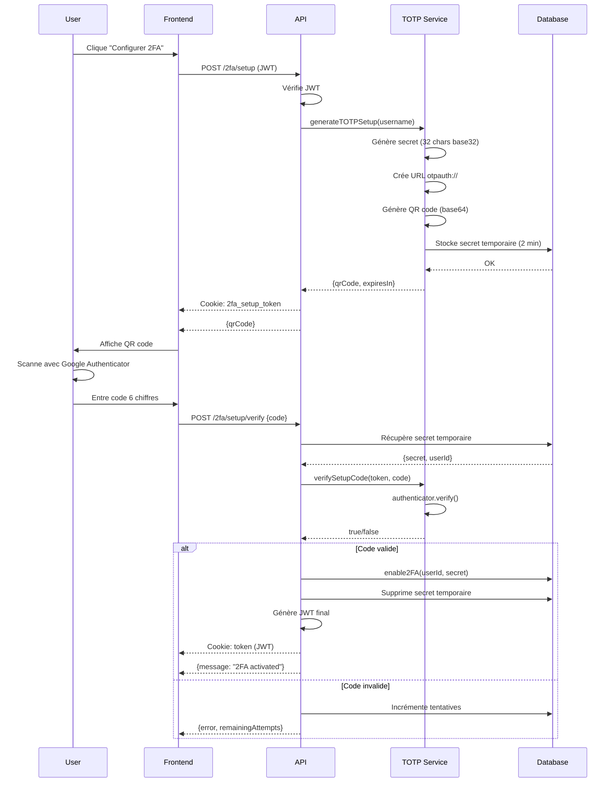
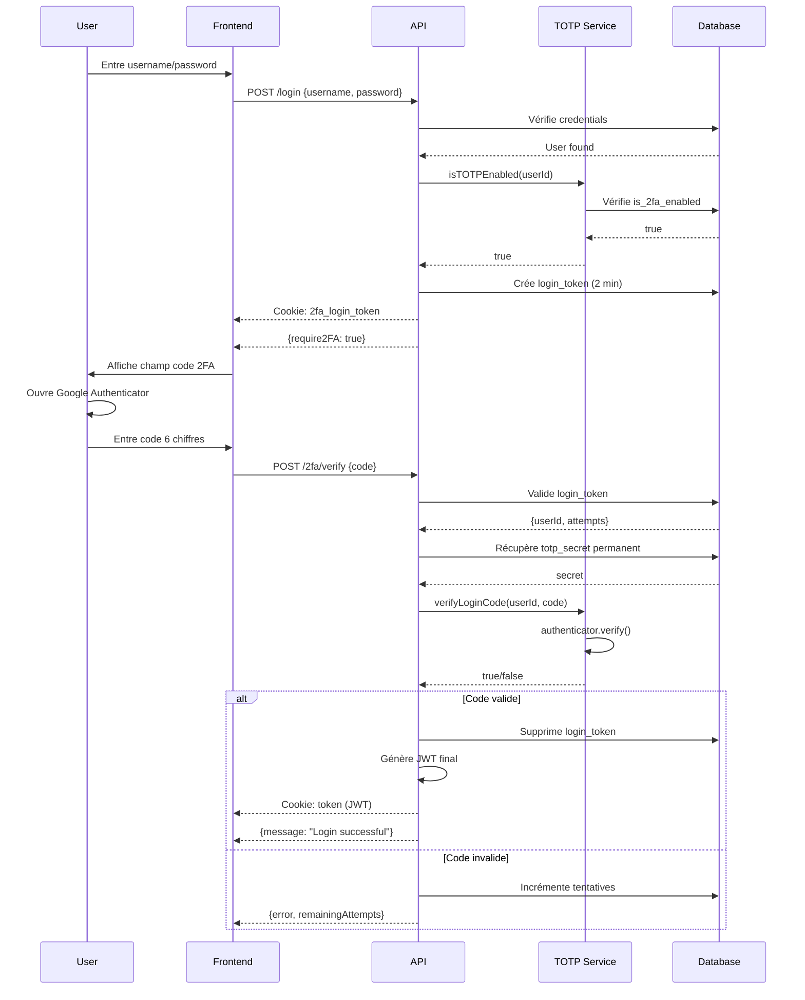

# Architecture 2FA - Documentation Technique

## Vue d'ensemble

Le système d'authentification à deux facteurs (2FA) utilise le protocole **TOTP** (Time-based One-Time Password) compatible avec Google Authenticator, Microsoft Authenticator, Authy, etc.

## Architecture

### Structure modulaire

```
srcs/auth/src/
├── services/
│   ├── totp.service.ts      # Service dédié 2FA (NOUVEAU)
│   ├── auth.service.ts       # Service d'authentification principal
│   ├── database.ts           # Accès base de données
│   └── jwt.service.ts        # Gestion JWT
├── controllers/
│   └── auth.controller.ts    # Handlers HTTP 2FA
└── routes/
    └── auth.routes.ts        # Routes API
```

### Base de données

#### Tables principales

**`users`** - Stockage permanent des configurations 2FA

```sql
CREATE TABLE users (
  id INTEGER PRIMARY KEY,
  username TEXT UNIQUE,
  email TEXT UNIQUE,
  password TEXT,
  role TEXT DEFAULT 'user',
  is_2fa_enabled INTEGER DEFAULT 0,  -- Flag activation 2FA
  totp_secret TEXT                    -- Secret TOTP permanent
);
```

**`totp_setup_secrets`** - Stockage temporaire pendant le setup (2 minutes)

```sql
CREATE TABLE totp_setup_secrets (
  token TEXT PRIMARY KEY,           -- Token de session setup
  user_id INTEGER NOT NULL,
  secret TEXT NOT NULL,              -- Secret TOTP temporaire
  expires_at DATETIME NOT NULL,      -- Expiration (120s)
  FOREIGN KEY(user_id) REFERENCES users(id) ON DELETE CASCADE
);
```

**`login_tokens`** - Tokens de session login 2FA (2 minutes)

```sql
CREATE TABLE login_tokens (
  token TEXT PRIMARY KEY,
  user_id INTEGER NOT NULL,
  expires_at DATETIME NOT NULL,
  FOREIGN KEY(user_id) REFERENCES users(id) ON DELETE CASCADE
);
```

**`login_token_attempts`** - Compteur de tentatives échouées

```sql
CREATE TABLE login_token_attempts (
  token TEXT PRIMARY KEY,
  attempts INTEGER DEFAULT 0,       -- Max 3 tentatives
  FOREIGN KEY(token) REFERENCES login_tokens(token) ON DELETE CASCADE
);
```

## Flux d'authentification

### 1. Configuration initiale (Setup 2FA)



### 2. Login avec 2FA activée



## Configuration TOTP

### Paramètres (constants.ts)

```typescript
export const AUTH_CONFIG = {
  // TOTP Configuration
  TOTP_WINDOW: 1, // ±30 secondes
  TOTP_ISSUER: 'Transcendence', // Nom dans l'app

  // Sessions
  LOGIN_TOKEN_EXPIRATION_SECONDS: 120, // 2 minutes
  MAX_LOGIN_TOKEN_ATTEMPTS: 3, // 3 tentatives max

  // JWT
  JWT_EXPIRATION: '1h',
  COOKIE_MAX_AGE_SECONDS: 3600, // 1 heure
  COOKIE_2FA_MAX_AGE_SECONDS: 120, // 2 minutes
};
```

### Compatibilité

- ✅ Google Authenticator
- ✅ Microsoft Authenticator
- ✅ Authy
- ✅ 1Password
- ✅ Toute app TOTP standard (RFC 6238)

## Endpoints API

### POST `/2fa/setup`

Initialise la configuration 2FA

**Headers:**

- `Cookie: token=<JWT>` (authentification requise)

**Response 200:**

```json
{
  "result": {
    "qrCode": "data:image/png;base64,...",
    "message": "Scan the QR code with Google Authenticator",
    "expiresIn": 120
  }
}
```

**Errors:**

- `401`: Token manquant/invalide
- `400`: 2FA déjà activée

---

### POST `/2fa/setup/verify`

Vérifie le code et active la 2FA

**Headers:**

- `Cookie: 2fa_setup_token=<token>` (session setup)

**Body:**

```json
{
  "code": "123456"
}
```

**Response 200:**

```json
{
  "result": {
    "message": "2FA successfully activated",
    "username": "john_doe"
  }
}
```

**Errors:**

- `400`: Code invalide (format ou valeur)
- `401`: Session expirée
- `429`: Trop de tentatives (3 max)

---

### POST `/2fa/verify`

Vérifie le code lors du login

**Headers:**

- `Cookie: 2fa_login_token=<token>` (session login)

**Body:**

```json
{
  "code": "123456"
}
```

**Response 200:**

```json
{
  "result": {
    "message": "Login successful",
    "username": "john_doe"
  }
}
```

**Errors:**

- `400`: Code invalide
- `401`: Session expirée
- `429`: Trop de tentatives

---

### POST `/2fa/disable`

Désactive la 2FA

**Headers:**

- `Cookie: token=<JWT>` (authentification requise)

**Response 200:**

```json
{
  "result": {
    "message": "2FA successfully disabled",
    "username": "john_doe"
  }
}
```

## Sécurité

### Principes appliqués

1. **Secret côté serveur uniquement**
   - Le secret TOTP ne transite JAMAIS par le réseau
   - Stockage temporaire sécurisé (2 minutes)
   - Suppression automatique après activation/expiration

2. **Sessions limitées dans le temps**
   - Setup 2FA: 120 secondes
   - Login 2FA: 120 secondes
   - Nettoyage automatique toutes les 5 minutes

3. **Rate limiting**
   - 3 tentatives maximum par session
   - Compteur persistant en base de données
   - Blocage après dépassement

4. **Validation stricte**
   - Code exactement 6 chiffres numériques
   - Fenêtre de tolérance: ±30 secondes
   - Vérification de cohérence userId

5. **Cookies sécurisés**
   - `httpOnly: true` (protection XSS)
   - `secure: true` (HTTPS en production)
   - `sameSite: 'strict'` (protection CSRF)

### Maintenance automatique

```typescript
// Nettoyage toutes les 5 minutes
setInterval(
  () => {
    totpService.cleanupExpiredSessions();
  },
  5 * 60 * 1000,
);
```

Supprime:

- Sessions setup expirées
- Login tokens expirés
- Compteurs de tentatives orphelins

## Logs et monitoring

### Events loggés

**Setup:**

- `totp_secret_generated`: Secret créé
- `totp_setup_session_created`: Session initiée
- `totp_setup_code_valid`: Code accepté
- `totp_setup_code_invalid`: Code refusé
- `totp_enabled`: 2FA activée

**Login:**

- `login_2fa_required`: 2FA demandée
- `totp_login_code_valid`: Code accepté
- `totp_login_code_invalid`: Code refusé
- `2fa_verify_success`: Login réussi

**Maintenance:**

- `totp_cleanup_completed`: Nettoyage effectué

## Tests

### Test manuel

1. **Setup 2FA:**

   ```bash
   # Login
   curl -X POST http://localhost:3000/api/auth/login \
     -H "Content-Type: application/json" \
     -d '{"username":"admin","password":"admin123"}' \
     -c cookies.txt

   # Setup
   curl -X POST http://localhost:3000/api/auth/2fa/setup \
     -b cookies.txt

   # Scanner le QR code avec Google Authenticator

   # Vérifier
   curl -X POST http://localhost:3000/api/auth/2fa/setup/verify \
     -H "Content-Type: application/json" \
     -d '{"code":"123456"}' \
     -b cookies.txt
   ```

2. **Login avec 2FA:**

   ```bash
   # Login (retourne require2FA)
   curl -X POST http://localhost:3000/api/auth/login \
     -H "Content-Type: application/json" \
     -d '{"username":"admin","password":"admin123"}' \
     -c cookies.txt

   # Verify
   curl -X POST http://localhost:3000/api/auth/2fa/verify \
     -H "Content-Type: application/json" \
     -d '{"code":"123456"}' \
     -b cookies.txt
   ```

## Performance

### Optimisations

- **Statements préparés** (better-sqlite3)
- **Transactions DB** pour opérations multiples
- **Index** sur colonnes recherchées
- **Cleanup asynchrone** (interval)

### Métriques

- Setup 2FA: ~100ms
- Verify code: ~50ms
- Cleanup: ~10ms (dépend du nombre de sessions)

## Migration

Si vous avez des utilisateurs existants avec 2FA:

```sql
-- Vérifier les données
SELECT id, username, is_2fa_enabled,
       CASE WHEN totp_secret IS NULL THEN 'NO SECRET' ELSE 'OK' END as secret_status
FROM users
WHERE is_2fa_enabled = 1;

-- Corriger les incohérences
UPDATE users
SET is_2fa_enabled = 0, totp_secret = NULL
WHERE is_2fa_enabled = 1 AND totp_secret IS NULL;
```

## Troubleshooting

### Code toujours invalide

1. **Vérifier l'horloge serveur:**

   ```bash
   date
   timedatectl status
   ```

   Le TOTP nécessite une synchronisation NTP précise (±30s)

2. **Vérifier la fenêtre TOTP:**

   ```typescript
   authenticator.options.window = 1; // ±30s
   ```

3. **Logs détaillés:**
   ```bash
   # Activer debug
   LOG_LEVEL=debug npm start
   ```

### Session expirée trop vite

Augmenter la durée dans `constants.ts`:

```typescript
LOGIN_TOKEN_EXPIRATION_SECONDS: 180, // 3 minutes
```

### Trop de tentatives

Réinitialiser manuellement:

```sql
DELETE FROM login_token_attempts WHERE token = 'xxx';
```

## Références

- [RFC 6238](https://tools.ietf.org/html/rfc6238) - TOTP Specification
- [RFC 4226](https://tools.ietf.org/html/rfc4226) - HOTP Algorithm
- [otplib](https://github.com/yeojz/otplib) - Library utilisée
- [Google Authenticator](https://github.com/google/google-authenticator/wiki/Key-Uri-Format) - Key URI Format
